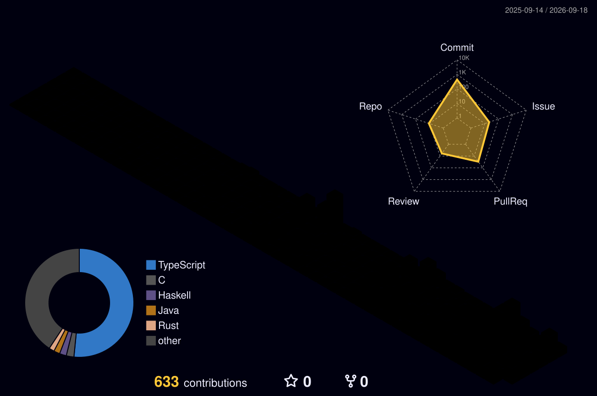

  

## About Me
I'm **KoHaRxnP** (He/Him). I'm a **Fullstack Developer** passionate about building robust and scalable applications.

### Pron.: kohaɾɯpʲii

## My Thought

> Do not add. Subtract. But never let it drop below zero. 

I believe that systems become less user-friendly and lose their groundbreaking nature when they are burdened with unnecessary features or constrained by existing ways of thinking. By first rejecting existing approaches and then rebuilding from scratch, I believe we can create software that minimizes trade-offs to the absolute limit. Rather than resigning ourselves to trade-offs from the outset, the path to new technology lies in changing our approach and experimenting to find ways to overcome them through trial and error.

> Adding a negative number to a value only decreases it.

Much of the source code out there starts out beautiful and clean. However, as developers keep adding things—such as “we might significantly expand this feature in the future” or “even though no one uses it, let’s support that old, end-of-life OS”—they gradually pile on truly unnecessary elements or code that will remain useless for at least several years. As a result, usability and maintainability may decline before those added features are even used, potentially forcing the project to be abandoned. Therefore, I strongly believe we should reject the practice of clinging to unnecessary ideas and haphazardly adding source code with no clear purpose.

> Hardware evolves to empower users, not to excuse lazy code.

Modern devices are incredibly powerful, but that is never an excuse to ship bloated, resource-heavy software. Treating users' memory and CPU as infinite resources is a display of developer arrogance. Efficiency is not an optimization stage at the end of a project; it is a core feature that must be preserved from the very first line of code.

> The best code is the code that is easiest to replace.

Many developers attempt to write "perfect code" that can withstand any future change. This is an illusion that leads to over-engineering. True sustainability is not about building an unshakeable fortress, but about creating simple, independent modules that can be thrown away and rebuilt in a single day. Do not write code to last forever; write code that is effortless to replace when the time comes.

## Links

---

## My Skills

  <h3>Languages</h3>
  

  <h3>Frameworks</h3>
  

  <h3>Applications</h3>
  

  <h3>Infrastructure & Tools</h3>
  

---

## What I'm Focusing On

### 🌊 [Watervein](https://github.com/waterveinjs/watervein)
> **No component. No tree. A radical re-imagining of UI systems.**

I am currently developing **Watervein**, a frontend rendering system built entirely on my philosophy of "subtraction." It completely abandons the traditional, heavy "component tree" model and replaces it with a pure **DAG (Directed Acyclic Graph)** network. Lightweight!

If you are tired of virtual DOM diffing and nested lifecycle components, **check out the repository and leave a star! ⭐**

---

## My Organizations

---

## GitHub Stats

  
  
  

  

---

### Contribution Snake

### Trophies

### 3D Contributions

### Visitors

  

 